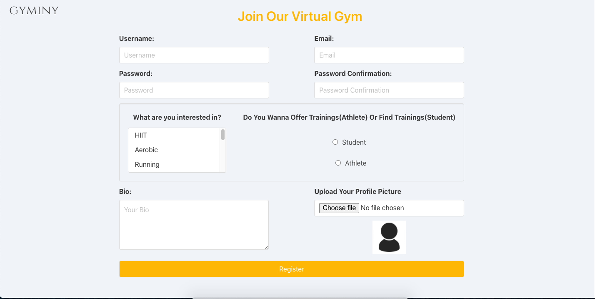
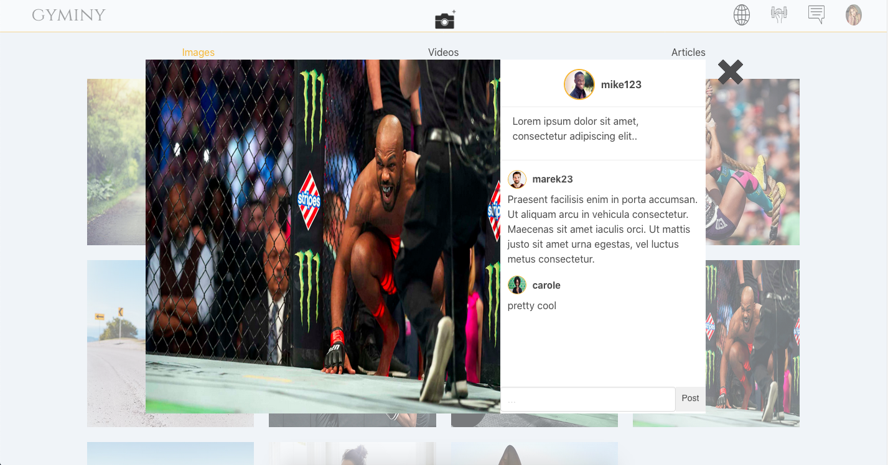
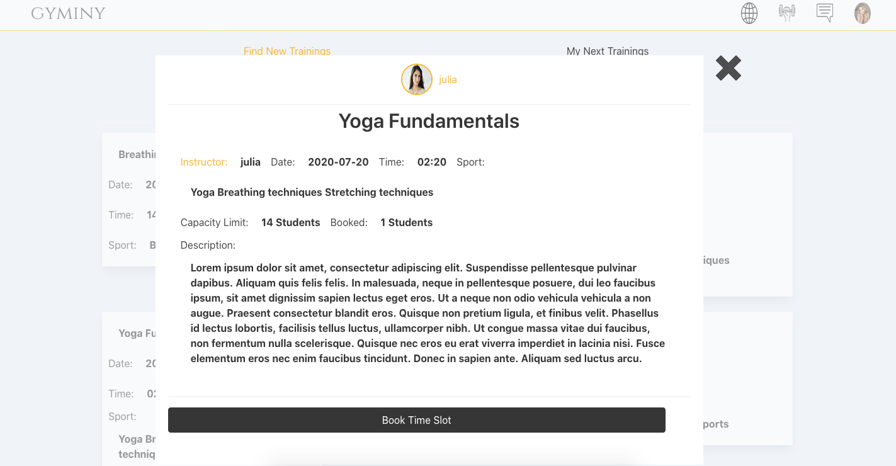
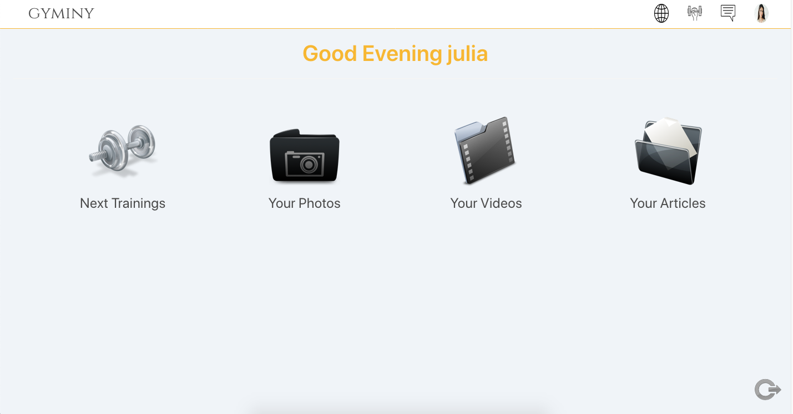
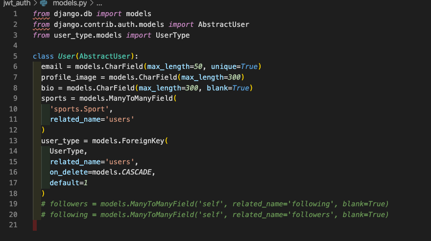
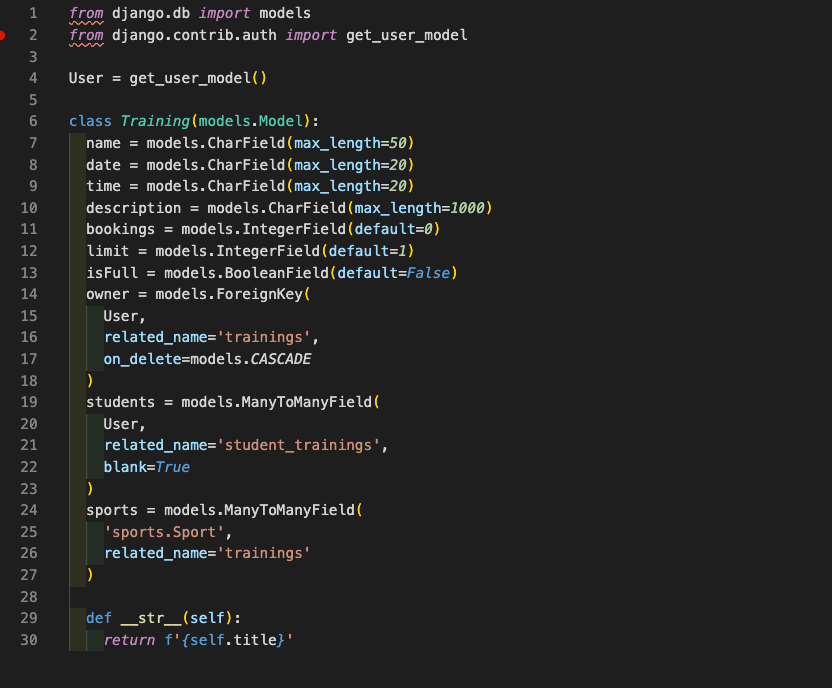

# SEI Project 4: Gyminy
 
## https://gyminy.herokuapp.com/
 
## **Overview.**
 
It is a "virtual gym" social app. There are two types of users, "athletes", and "students".
Athletes can have a portfolio of their photos and videos, and they can write articles. Athletes can offer time slots for training via Zoom on their profile page. Students can book training time slots, have a portfolio of their photos and videos, but they cant add any articles.
The time frame for the project was one week.
 

 
-------------------------
## Brief
 
* Build a full-stack application by making your own backend and your own front-end
* Use a Python Django API using Django REST Framework to serve your data from a Postgres database.
* Consume your API with a separate front-end built with React
* Be a complete product which most likely means multiple relationships and CRUD functionality for at least a couple of models.
* Implement thoughtful user stories/wireframes that are significant enough to help you know which features are core MVP and which you can cut.
* Have a visually impressive design.
* Be deployed online so it's publicly accessible.
 
## Get Started
 
* **Clone** or download the repo
* **pipenv** to install Python packages
* **python manage.py loaddata images/seeds.json** to load filters from the database
* **cd frontend** to go to the frontend directory
* **yarn** to install frontend dependencies
* **yarn build**
* go back to main directory and run **python manage.py runserver** to start the app
 
## **Technologies used.**
 
#### Front End:
* React
* Axios
* Bulma
* SaSS
* React router dom
* Cloudinary
 
#### Back End:
* Python
* Django
* Django Rest Framework
* JWT
* PostgreSQL
 
#### Dev Tools:
 
* Yarn
* VScode
* Insomnia
* Git
* Github
* Chrome Developer Tools
* Heroku
 
## How to use the App
 
### Login and  Register
 
Sign up for a new account after clicking Join Us on the homepage.
 

 
 
### Index Page
 
After you sign up for an account, you will be automatically logged in and redirected to the index page. Here you can see photos, videos, and articles from other users.
When you click on one of the photos/videos, you will see it on the full page and also a description and all the comments for photo/video.

## Training
 
If you click on the fist holding dumbbell icon, you will see the training page. As an Athlete, you would see your next training, so all the training which was booked by students, then in the menu you would have the option to see not booked training and also add new training time slot.
As a Student, you would see all the available training, then on the navbar, you would have the option to see training which you already booked.

## Profile Page
 
On your profile page, you can see all your photos, videos, next training, and if you're athlete, then also your articles.

 
## Development
 
The first day of the project was reserved for planning. I made wireframe in Balsamiq, I wrote down all the models I will need and deadlines throughout the week.
 
I started to code the next day. First I seted up development environment, and then I created first Djano apps. 
First I made "user_type", "sports", "images", "videos", and "articles" apps. 
"Sports", and "user_type" needs to be done as a first when database is created because User model require in registration user type, and sports,which user is interested in. 

After basic backend, I started to work on the frontend with React. I was thinking if I should finish backend and then start with a frontend, but I choosen to made basic backend and then work simultinaously on backend, and frontend because I prefer to visualize things when I work and see how it looks, what should I change, and what should I add. 

When I finished with basic frontend, I had idea on the way how training time slot reservation system would work. 

 
 
 
## Wins
 
Thanks to this project I have a better understanding of Django and I learned how to work with Django Rest Framework. All my previous project was done in JavaScript, so I was happy that I can practice Python syntax more.
 
## Challenge
 
The big challenge was working on Django views. It gave me a lot of headaches, but that feeling after it worked was worth it.

