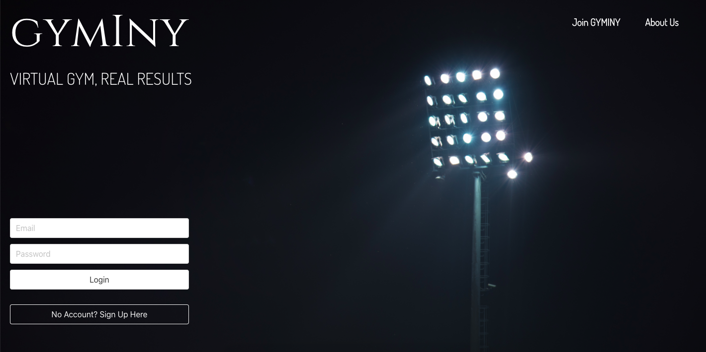

# SEI Project 4: Gyminy
## https://gyminy.herokuapp.com/
## **Overview.**
It is a "virtual gym" social app. There are two types of users, "athletes", and "students".
Athletes can have a portfolio of their photos and videos, and they can write articles. Athletes can offer time slots for training via Zoom on their profile page. Students can book training time slots, have a portfolio of their photos and videos, but they cant add any articles.
 
***Timeframe*** for the project was one week.
 

-------------------------
## Brief
* Build a full-stack application by making your own backend and your own front-end.
* Use a Python Django API using Django REST Framework to serve your data from a Postgres database.
* Consume your API with a separate front-end built with React.
* Be a complete product which most likely means multiple relationships and CRUD functionality for at least a couple of models.
* Implement thoughtful user stories/wireframes that are significant enough to help you know which features are core MVP and which you can cut.
* Have a visually impressive design.
* Be deployed online so it's publicly accessible.
<!-- ## Get Started
* **Clone** or download the repo
* **pipenv** to install Python packages
* **python manage.py loaddata images/seeds.json** to load filters from the database
* **cd frontend** to go to the frontend directory
* **yarn** to install frontend dependencies
* **yarn build**
* go back to main directory and run **python manage.py runserver** to start the app
-->
## **Technologies used.**
#### Front End:
* React
* Axios
* Bulma
* SaSS
* React router dom
* Cloudinary
#### Back End:
* Python
* Django
* Django Rest Framework
* JWT
* PostgreSQL
#### Dev Tools:
* Yarn
* VScode
* Insomnia
* Git
* Github
* Chrome Developer Tools
* Heroku
## How to use the App
### Login and  Register
Sign up for a new account after clicking Join Us on the homepage.
 

 
### Index Page
After you sign up for an account, you will be automatically logged in and redirected to the index page. Here you can see photos, videos, and articles from other users.
When you click on one of the photos/videos, you will see it on the full page and also a description and all the comments for photo/video.

## Training
If you click on the fist holding dumbbell icon, you will see the training page. As an Athlete, you would see your next training, so all the training which was booked by students, then in the menu you would have the option to see not booked training and also add new training time slot.
As a Student, you would see all the available training, then on the navbar, you would have the option to see training which you already booked.

## Profile Page
On your profile page, you can see all your photos, videos, next training, and if you're athlete, then also your articles.
 

 
## Development
 
### Timeline
* Day 1 - Planning
* Day 2 - 4 MVP was finished
* Day 5 - 6 Extra features were finished, and also existing features were polished
* Day 7 - Styling
 
### Planning
* The first day of the project was reserved for planning. I made wireframe in Balsamiq, I wrote down all the models I will need and deadlines throughout the week.
 
Website flow plan made on Balsamiq:
 

 
### Code
* I started to code the second day of the project week. First I set up a development environment, and then I created the first Django apps.
First I made "user_type", "sports", "images", "videos", and "articles" apps.
"Sports", and "user_type" need to be done as a first when the database is created because the User model requires registration user type, and sports, which the user is interested in.

* After basic backend, I started to work on the frontend with React. I was thinking if I should finish backend and then start with a frontend, but I choose to make basic backend and then work simultaneously on backend, and frontend because I prefer to visualize things when I work and see how it looks, what should I change, and what should I add.
When I finished with the basic frontend, I had an idea of the way how the **training time slot** reservation system will work.

* Most difficult thing in training reservation system was making sure that after Student booked a training, it will be saved in their database as a "student trainings", and also that it will be shown in Athletes database that student booked training, how many students booked training, and if training is already fully booked.

## Wins
* Thanks to this project I have a better understanding of Django and I learned how to work with Django Rest Framework. All my previous project was done in JavaScript, so I was happy that I can practice Python syntax more.
* I learned how to properly plan project development. From having an idea of the project, thinking about the way of promoting it, setting deadlines, making a wireframe, choosing the right design, fonts, colors, designing possible features of the project, and planning projects overall.
 
## Challenge
* The biggest challenge was working on **Django views**. It gave me a lot of headaches, but I still enjoyed it, and it was worth it.
* **Single Photo/Video Display** - I didn't want to make a separate page to display single portfolio item, but I decided to make it in Instagram style, and after clicking on photo or video, show it in the middle of the index page with its comments and owner-user profile picture on the left side.
It was very challenging on the front end side. Making that design was no problem at all, but using the right data in the right place was pretty hard.
* Using **Cloudinary** to store all user photos and videos. I didn't have much experience with Cloudinary before, so I needed to use a lot of documentation to figure out how to properly use it.
 
 
 
